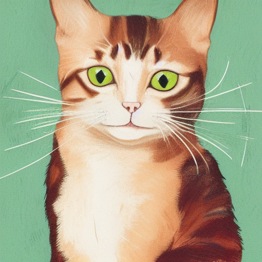
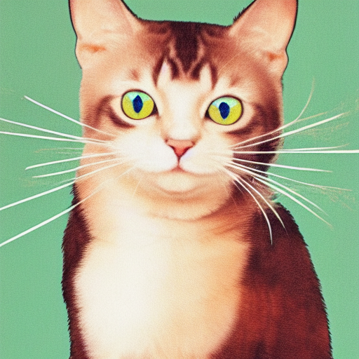
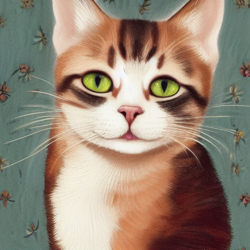

# wasmedge-stable-diffusion
A Rust library for using stable diffusion functions when the Wasi is being executed on WasmEdge.
## Set up WasmEdge

```Bash
git clone https://github.com/WasmEdge/WasmEdge.git
cd WasmEdge
cmake -GNinja -Bbuild -DCMAKE_BUILD_TYPE=Release -DWASMEDGE_BUILD_TESTS=OFF -DWASMEDGE_PLUGIN_STABLEDIFFUSION=On -DWASMEDGE_USE_LLVM=OFF
cmake --build build
sudo cmake --install build
```

## Download Model
Download the weights or quantized model from the following command.  
You also can use our example to quantize the weights by yourself.

stable-diffusion v1.4: [second-state/stable-diffusion-v-1-4-GGUF](https://huggingface.co/second-state/stable-diffusion-v-1-4-GGUF)  
stable-diffusion v1.5: [second-state/stable-diffusion-v1-5-GGUF](https://huggingface.co/second-state/stable-diffusion-v1-5-GGUF)  
stable-diffusion v2.1: [second-state/stable-diffusion-2-1-GGUF](https://huggingface.co/second-state/stable-diffusion-2-1-GGUF)

```
curl -L -O https://huggingface.co/second-state/stable-diffusion-v-1-4-GGUF/resolve/main/sd-v1-4.ckpt
curl -L -O https://huggingface.co/second-state/stable-diffusion-v-1-4-GGUF/resolve/main/stable-diffusion-v1-4-Q8_0.gguf
```

## Compile example file
The compiled `.wasm` file located at `./target/wasm32-wasi/release/`, and named `wasmedge_stable_diffusion_example.wasm`
```Bash
cargo build --target wasm32-wasi --release
```

## Run
It supports two mode: txt2img and img2img.

### txt2img
Assume that the model `stable-diffusion-v-1-4-GGUF` is located in the models folder of the same directory as this project.
```Bash
wasmedge --dir .:. ./target/wasm32-wasi/release/wasmedge_stable_diffusion_example.wasm -m ../../models/stable-diffusion-v1-4-Q8_0.gguf -p "a lovely cat"
```
<p align="center">
  
</p>

### img2img
- `./output.png` is the image generated from the above txt2img pipeline
```Bash
wasmedge --dir .:. ./target/wasm32-wasi/release/wasmedge_stable_diffusion_example.wasm --mode img2img -m ../../models/stable-diffusion-v1-4-Q8_0.gguf -p "cat with red eyes" -i ./output.png -o ./img2img_output.png
```
<p align="center">
  
</p>

### Convert
- Stable Diffusion model: [sd-v1-4.ckpt](), which type is Q8_0.
```Bash
wasmedge --dir .:. ./target/wasm32-wasi/release/wasmedge_stable_diffusion_example.wasm  --mode convert -o stable-diffusion-v1-4-Q8_0_test.gguf -m ../../models/sd-v1-4.ckpt --type q8_0
```
If you want to use the converted model, please use `--type` to asign the type `Q8_0`.

## More Guides - LoRA
### Get weights
- LoRA model: [v1-5-pruned-emaonly.safetensors](https://huggingface.co/runwayml/stable-diffusion-v1-5/resolve/main/v1-5-pruned-emaonly.safetensors)
```Bash
curl -L -O https://huggingface.co/runwayml/stable-diffusion-v1-5/resolve/main/v1-5-pruned-emaonly.safetensors
```
### txt2img
You can specify the directory where the lora weights are stored via `--lora-model-dir`.
If not specified, the default is the current working directory.
```Bash
wasmedge --dir .:. ./target/wasm32-wasi/release/wasmedge_stable_diffusion_example.wasm \
--lora-model-dir ../../lora \
--model ../../lora/v1-5-pruned-emaonly.safetensors \
-p "a lovely cat<lora:marblesh:1>" \
-o output_lora_txt2img.png
```
The lora model `../../lora/sd_xl_base_1.0.safetensors` and vae model `../../lora/sdxl_vae.safetensors` will be applied to the model.
<p align="center">
  
</p>

### img2img
```Bash
wasmedge --dir .:. ./target/wasm32-wasi/release/wasmedge_stable_diffusion_example.wasm \
-p "with blue eyes<lora:marblesh:1>" \
--lora-model-dir ../../lora \
--model ../../lora/v1-5-pruned-emaonly.safetensors \
-i output_lora_txt2img.png \
-o output_lora_img2img.png
```
<p align="center">
  
</p>

## Supported parameters
```
usage: wasmedge --dir .:. ./target/wasm32-wasi/release/wasmedge_stable_diffusion_example.wasm [arguments]

arguments:
  -M, --mode [MODEL]                 run mode (txt2img or img2img or convert, default: txt2img)
  -t, --threads N                    number of threads to use during computation (default: -1).If threads <= 0, then threads will be set to the number of CPU physical cores
  -m, --model [MODEL]                path to full model
  --diffusion-model                  path to the standalone diffusion model
  --clip_l                           path to the clip-l text encoder
  --t5xxl                            path to the the t5xxl text encoder
  --vae [VAE]                        path to vae
  --taesd [TAESD_PATH]               path to taesd. Using Tiny AutoEncoder for fast decoding (low quality)
  --control-net [CONTROL_PATH]       path to control net model
  --embd-dir [EMBEDDING_PATH]        path to embeddings
  --stacked-id-embd-dir [DIR]        path to PHOTOMAKER stacked id embeddings
  --input-id-images-dir [DIR]        path to PHOTOMAKER input id images dir
  --normalize-input                  normalize PHOTOMAKER input id images
  --upscale-model [ESRGAN_PATH]      path to esrgan model. Upscale images after generate, just RealESRGAN_x4plus_anime_6B supported by now
  --upscale-repeats                  Run the ESRGAN upscaler this many times (default 1)
  --type [TYPE]                      weight type (f32, f16, q4_0, q4_1, q5_0, q5_1, q8_0, q2_k, q3_k, q4_k)
                                     If not specified, the default is the type of the weight file
  --lora-model-dir [DIR]             lora model directory
  -i, --init-img [IMAGE]             path to the input image, required by img2img
  --control-image [IMAGE]            path to image condition, control net
  -o, --output OUTPUT                path to write result image to (default: ./output.png)
  -p, --prompt [PROMPT]              the prompt to render
  -n, --negative-prompt PROMPT       the negative prompt (default: "")
  --cfg-scale SCALE                  unconditional guidance scale: (default: 7.0)
  --strength STRENGTH                strength for noising/unnoising (default: 0.75)
  --style-ratio STYLE-RATIO          strength for keeping input identity (default: 20%)
  --control-strength STRENGTH        strength to apply Control Net (default: 0.9)
                                     1.0 corresponds to full destruction of information in init image
 
  --guidance                         guidance
  -H, --height H                     image height, in pixel space (default: 512)
  -W, --width W                      image width, in pixel space (default: 512)
  --sampling-method {euler, euler_a, heun, dpm2, dpm++2s_a, dpm++2m, dpm++2mv2, ipndm, ipndm_v, lcm}
                                     sampling method (default: "euler_a")
  --steps  STEPS                     number of sample steps (default: 20)
  --rng {std_default, cuda}          RNG (default: cuda)
  -s SEED, --seed SEED               RNG seed (default: 42, use random seed for < 0)
  -b, --batch-count COUNT            number of images to generate
  --schedule {discrete, karras, exponential, ays, gits} Denoiser sigma schedule (default: discrete)
  --clip-skip N                      ignore last layers of CLIP network; 1 ignores none, 2 ignores one layer (default: -1)
                                     <= 0 represents unspecified, will be 1 for SD1.x, 2 for SD2.x
  --vae-tiling                       process vae in tiles to reduce memory usage
  --vae-on-cpu                       keep vae in cpu (for low vram)
  --clip-on-cpu                      keep clip in cpu (for low vram)
  --control-net-cpu                  keep controlnet in cpu (for low vram)
  --canny                            apply canny preprocessor (edge detection)
```


